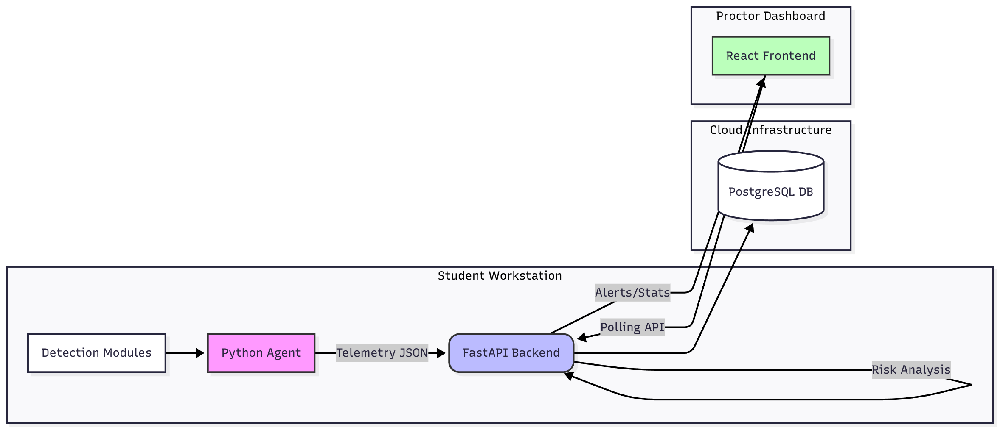
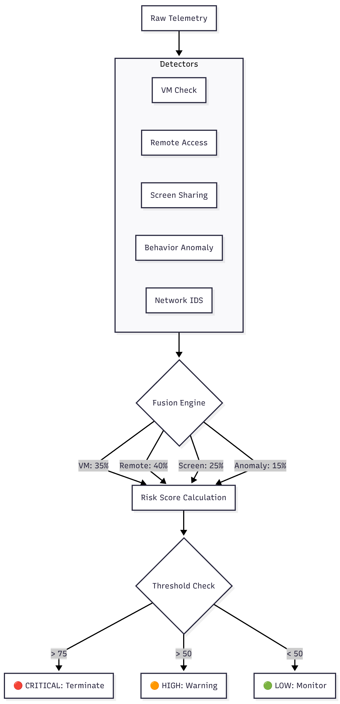

# 🛡️ ProctorGuard: VM & Remote Access Detection System

> **IICPC Technical Challenge - Track 3**  
> A comprehensive, real-time integrity monitoring system for online examinations.


---

## 🎥 Project Demo

<!-- 🔴 ACTION REQUIRED: Upload your video to YouTube/Vimeo/Drive and replace the link below -->
[](https://www.youtube.com/channel/UCe_rdRG8fpOV7MP5I2B7gfA)

---

## 📖 Overview

**ProctorGuard** is an advanced security platform designed to detect and prevent cheating in online assessments. Unlike simple browser-based proctoring, ProctorGuard runs at the system level to identify sophisticated evasion techniques.

It consists of three integrated components:
1.  **Client Agent (EXE):** Runs on the student's machine to detect VMs, remote desktop tools, and suspicious behavior.
2.  **Central Server (API):** Processes telemetry, runs a Fusion Engine to calculate risk scores, and stores data.
3.  **Sentinel Dashboard:** A real-time command center for proctors to monitor sessions and receive critical alerts.

---

## 🏗️ System Architecture

### High-Level Data Flow


### Detection Logic (Fusion Engine)


---

## ✨ Key Features

### 1. 🖥️ Virtualization Detection
Detects if the exam is running inside a VM (VMware, VirtualBox, Hyper-V, QEMU, Parallels) using:
*   CPUID Hypervisor flags.
*   MAC Address OUI lookup.
*   Driver and Registry heuristics.
*   Timing attacks (RDTSC variance).

### 2. 📡 Remote Access & Screen Sharing
Identifies tools used for external help:
*   **Protocols:** RDP, VNC, SSH.
*   **Software:** TeamViewer, AnyDesk, Zoom, Discord, OBS.
*   **Hardware:** HDMI splitter/Secondary monitor detection.

### 3. 🧠 Behavioral Analysis
Uses heuristic analysis to detect non-human input:
*   Impossible typing speeds (Macros/Bots).
*   Mouse jitter and path linearity (Remote mouse control).
*   Focus loss patterns.

### 4. 🌐 Network Forensics & IDS
*   Detects connections to private networks/proxies.
*   Analyzes traffic asymmetry (Data exfiltration).
*   Identifies port scanning behavior.

---

## 🛠️ Tech Stack

| Component | Technologies |
| :--- | :--- |
| **Agent** | Python 3.10, Psutil, Pynput, PyInstaller |
| **Backend** | Python FastAPI, SQLAlchemy, PostgreSQL, Uvicorn |
| **Frontend** | React, TypeScript, Vite, Tailwind CSS, Shadcn UI, Recharts |
| **DevOps** | Docker, Docker Compose, Render (Backend), Vercel (Frontend) |

---

## 🚀 Installation & Setup

### Option A: Quick Start (Docker) 🐳
The easiest way to run the Server and Dashboard locally.

1.  **Clone the repository:**
    ```bash
    git clone https://github.com/yourusername/proctor-guard.git
    cd proctor-guard
    ```

2.  **Run Docker Compose:**
    ```bash
    docker-compose up --build
    ```

3.  **Access the App:**
    *   **Dashboard:** `http://localhost`
    *   **API Docs:** `http://localhost:8000/docs`

---

### Option B: Manual Local Setup

#### 1. Backend Setup
```bash
cd vm-detection-system/server
pip install -r requirements.txt
python main.py
# Server runs on http://localhost:8000
```

#### 2. Frontend Setup
```bash
cd frontend
npm install
npm run dev
# Dashboard runs on http://localhost:8080 (or 5173)
```

#### 3. Agent Setup (Student Side)
```bash
cd vm-detection-system/agent
pip install -r requirements.txt
# Run directly
python main.py --server http://localhost:8000
# OR Build Executable
pyinstaller --onefile --name ProctorAgent main.py
```

---

## ☁️ Deployment Guide

### 1. Deploy Backend (Render)
1.  Create a PostgreSQL database on Render.
2.  Create a Web Service using the `vm-detection-system/server` directory.
3.  Set Build Command: `pip install -r requirements.txt`
4.  Set Start Command: `uvicorn main:app --host 0.0.0.0 --port $PORT`
5.  Add Environment Variable: `DATABASE_URL` (from your Postgres DB).

### 2. Deploy Frontend (Vercel)
1.  Import repository to Vercel.
2.  Set Root Directory to `frontend`.
3.  Add Environment Variable: `VITE_API_URL` = `https://your-render-app.onrender.com`.
4.  Deploy.

### 3. Distribute Agent
1.  Update `agent/main.py` with your deployed Render URL.
2.  Build the `.exe` using PyInstaller.
3.  Share `ProctorAgent.exe` with users.

---

## 🧪 Testing the System

1.  **Launch the Dashboard** (Local or Vercel link).
2.  **Run the Agent** on a machine.
3.  **Trigger Alerts:**
    *   Open a remote tool (e.g., AnyDesk) or simply rename a notepad window to "TeamViewer" to test detection.
    *   Connect a second monitor.
    *   Run inside a Virtual Machine.
4.  **Observe:** The Dashboard updates instantly with "CRITICAL" risk status.

---

## 🔮 Future Scope
*   **Face Detection:** Integration with OpenCV for webcam proctoring.
*   **Audio Analysis:** Detecting speech patterns or background voices.
*   **Mobile App:** A companion app for 360-degree room scanning.
*   **Blockchain:** Storing integrity logs on-chain for immutability.

---

## 👥 Team
*   **Raj Kalpesh Mathuria** - Lead Developer & Researcher
*   *IICPC Track 3 Submission*

---

**License:** MIT